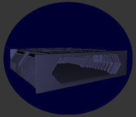
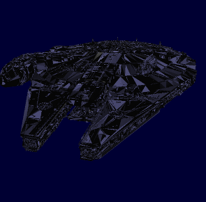
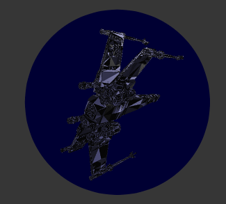
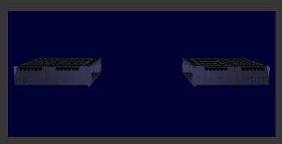
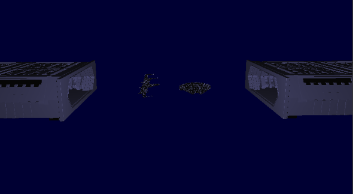

# Star Wars Scene Simulation

This project simulates a Star Wars-inspired 3D scene where two spaceships depart from opposite hangars and move across the scene towards the opposite hangar. The objective is to demonstrate the use of 3D transformations, camera controls, lighting, and object loading in OpenGL.

**Language:** C++  
**Libraries:** OpenGL, GLFW, GLAD, GLM  

---

## Project Overview
- Two **3D hangars** are placed facing each other.  
- A spaceship starts in each hangar.  
- When pressing the **Space key**, both ships start moving simultaneously towards the opposite hangar.  
- The motion is interpolated over time, giving a smooth flight effect.  
- The scene is rendered with lighting and shading to enhance realism.  
- The user can navigate the scene using a **movable camera**.  

---

## Features
- 🛸 **Two Spaceships**: Models loaded from `.obj` files (`t65fighter.obj` and `nave5.obj`)  
- 🏭 **Two Hangars**: 3D hangar models (`hangar2.obj`) rendered at opposite positions  
- 💡 **Lighting**: Basic Phong lighting with ambient, diffuse, and specular components  
- 🎥 **Camera Control**: Free camera movement with **WASD** keys and mouse  
- ⌨️ **Interactive Control**: Press **SPACE** to start the ships’ movement  
- 🌌 **Star Wars Atmosphere**: Dark background and dynamic rendering for immersive feeling  

---

## Technical Details
- **Language:** C++  
- **Graphics API:** OpenGL 3.3 Core Profile  
- **Libraries Used:**  
  - [GLFW](https://www.glfw.org/) – window creation & input  
  - [GLAD](https://glad.dav1d.de/) – OpenGL function loader  
  - [GLM](https://glm.g-truc.net/) – math library (matrices, vectors, transformations)  
  - OBJ loader for reading 3D models  
- **Shaders:** Implemented Phong lighting (`.vs` and `.fs` shaders)  

---

## Controls
- **W / A / S / D** → Move camera forward, left, backward, right  
- **Mouse** → Rotate camera  
- **Scroll** → Zoom in/out  
- **SPACE** → Launch the spaceships  

---

## Screenshots

| Hangar | Millennium Falcon | T-65 Fighter | Two Hangars | Scene |
|----------|----------------------|----------------|
|  |  |  |  | 

---

## Running the Project ▶️
1. Clone the repository:  
```bash
git clone https://github.com/ruipedrogil/Computer-Graphics-2nd-Project.git
